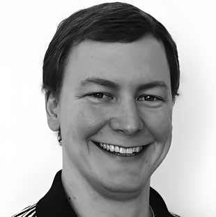

# Patrick Howard

## Information

- **Name**: Patrick Howard
- **Role**: CEO | Co-Founder | Full Stack Developer
- **Email**: patrick.howard@noclocks.dev

## Image

## Biography

As a Full Stack Developer with a background in Biomedical Engineering, I have applied my interdisciplinary skills and knowledge in research, analytics, data management, software development, web/mobile applications, DevOps, SaaS/PaaS, and cloud computing to create innovative solutions for a variety of projects across a breadth of frameworks and services. I have years of experience as a Full Stack Developer, working with multiple programming languages, development frameworks, and cloud infrastructures. I have developed OSS & PaaS for R programmers and R/Shiny developers, including user authentication and web app hosting, as well as web applications for clients from diverse professional fields. I have also handled the application development life-cycle, database, server, and API creation/maintenance, and automated tasks for both web & mobile applications & solutions, for both internal use and client needs. I am a quick learner with a passion for always improving upon my existing knowledge and skills, as well as learning new ones. I have experience in working autonomously, one-on-one, and as a group, with colleagues, clients, and third-party members.

## Links

- **GitHub**: [phoward38](https://github.com/phoward38)
- **LinkedIn**: [Patrick Howard](https://www.linkedin.com/in/phoward38)
- **Twitter**: [@phoward38](https://twitter.com/phoward38)
